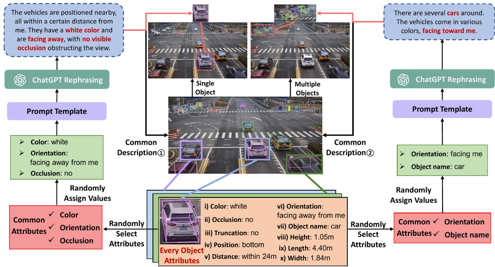

# VLMOD: Understanding Multi-Object World from Monocular View

> 本仓库为「2025 VLP 挑战赛参赛作品」。

Author: Keyu Guo, Yongle Huang, Shijie Sun, Xiangyu Song, Mingtao Feng, Zedong Liu, Huansheng Song, Tiantian Wang, Jianxin Li, Naveed Akhtar and Ajmal Saeed Mian

The paper has been accepted by **2025 IEEE Conference on Computer Vision and Pattern Recognition (CVPR2025)** 🎉.

    This repository provides **partial code** for the **VLMOD Challenge (Track B)** — *Understanding Multi-Object World from Monocular View*.  

Repository: https://github.com/Lidk1/MemoryWontLeak_VLMOD

The task focuses on **multi-object 3D Visual Grounding (3DVG)** based on **a single monocular RGB image**, enabling machines to interpret complex scenes and spatial relationships using natural language.

## 🧠 Task Description
Given a monocular RGB image and a complex language description (e.g., *"find the red cup on the left side of the table and the black keyboard on the right side"*),  
the goal is to predict **each referred object’s**:
- 3D position (x, y, z)
- 3D size (width, height, depth)
- Orientation (rotation angle)

## 🚧 Core Challenges
- Multi-object scene parsing  
- Spatial relationship modeling  
- Accurate 3D property estimation  

## 📂 Code Release
We have **open-sourced part of our implementation** to help the community explore and reproduce results.  
You are encouraged to:

- Reproduce and verify the released modules  
- Implement or improve other components  
- Contribute new ideas for monocular 3D visual grounding  

